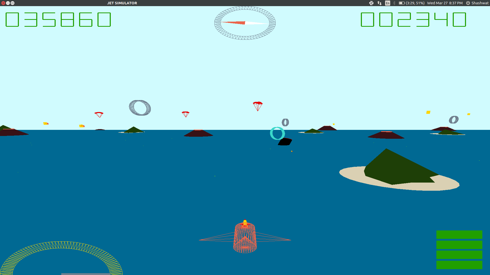
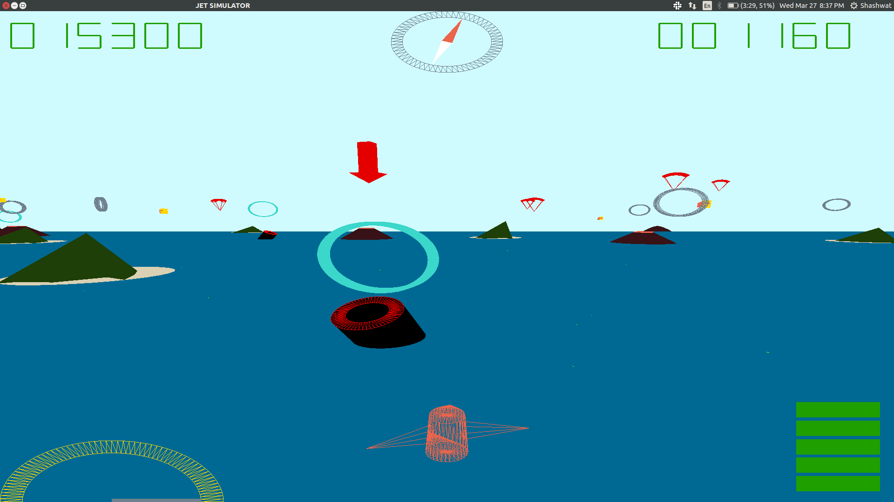

# Jet Simulator : 3D OpenGL
## Running the Simulator
```./run.sh```

## Controls:
### Camera Views:
-  Plane view (from the back) : ​P
-  Top View : ​T
-  Tower view :​ Y
-  Follow-cam view : ​F
-  Helicopter-cam view: ​H 
  - The helicopter view lets you observe the plane with the camera on a sphere of constant radius around the jet, looking at the centre of the jet.
  - Clicking and dragging will let you move the camera around on the sphere.
  - Scrolling will change the radius of the sphere.
  
### Plane Controls:
- Roll : ​A​ to roll Left and ​D​ to roll Right
- Turn : ​Q​ / ​Left arrow​ to turn left and ​E ​/ ​Right arrow​ to turn right
- Altitude Control : ​Space Bar​ to increase and ​S​ to decrease
- Acceleration : ​W ​/​ Up​ arrow to increase speed and ​Down​ arrow to decrease.
- Drop bomb : ​Right Click
- Shoot missile : ​Left Click

### Game Features:
- Circular Ring Checkpoints
  - Cannons below and around checkpoints fire bullets which on hitting the plane destroy it.
  - Jet can destroy cannons with bombs/missiles.
  - The next checkpoint is the one with a red arrow vertically above it.
  - Completed checkpoints appear in green.
- Volcanoes
  - Flying very close to volanoes can destroy the plane due to the heat, ending the game.
  - Maintain sufficient altitude over volcanoes.
- Enemy Parachutes
  - Can be shot to gain points. 
  - Do this fast as they keep falling downwards, stop them from landing safely. 
- Fuel ups 
  - Increases fuel to maximum. 
  - Running out of fuel finishes game.
  - Ensure you collect these regularly to avoid running out of fuel.
- Smoke Rings 
  - Passing through gives bonus points.
- Dashboard
  - Top left- Score 
  - Top right - Altimeter 
  - Bottom left - Speedometer 
  - Bottom Right- Fuel guage
  
## Special Features:
- 1) Dashboard Compass: Functional Compass which points towards the north direction.
- 2) Special stunts like barrel roll can be performed



